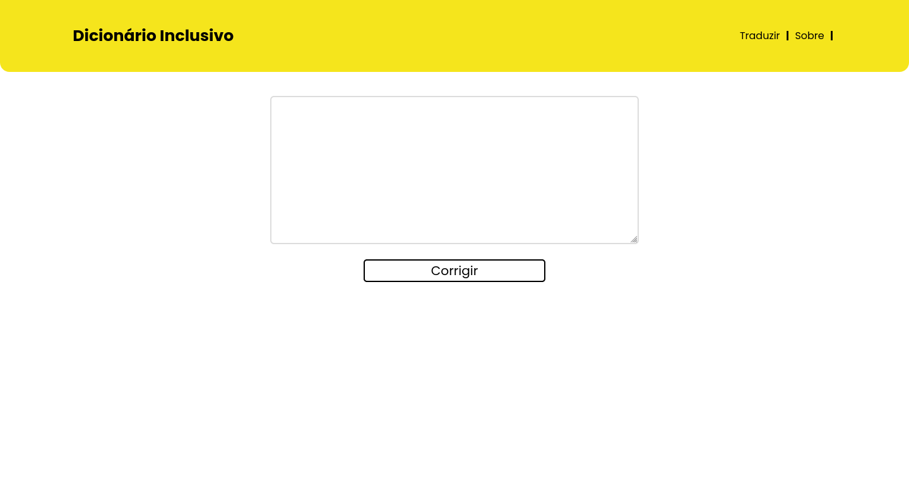

# Frontend do Dicionário Inclusivo

Projeto feito em VueJS, que basicamente há um campo, onde podemos escrever ou colar o texto, e um botão que irá enviar o texto ao backend, que irá corrigir todo o texto, e mostrar o texto corrigido na parte de baixo da tela.



## Rotas

`/` - Página inicial, sendo a parte de tradução do dicionário
`/contribuir` - Página para contribuir com o projeto, adicionando uma nova palavra
`/sobre` - Página com informações sobre o projeto

## Instalar dependências do projeto

```
yarn install
```

### Compilar e executar o projeto em modo de desenvolvimento

```
yarn serve
```

### Compilar para produção

```
yarn build
```

### _Linters_ e correções automáticas no código

```
yarn lint
```
